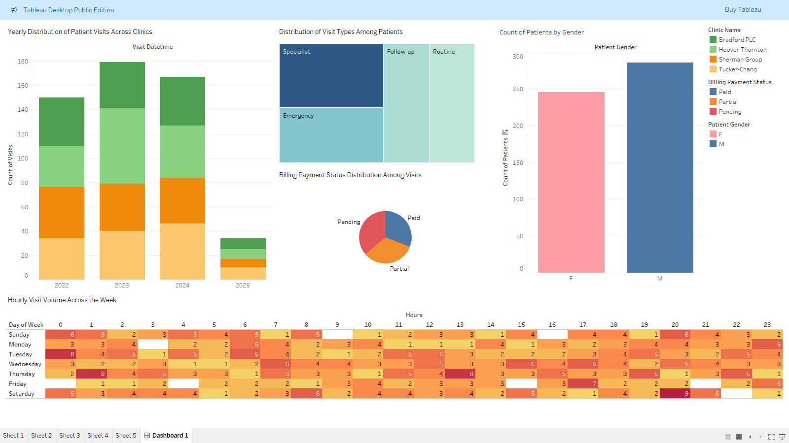

# Healthcare Data Normalization with PySpark

## Overview

This personal project showcases how legacy healthcare appointment data can be normalized into a structured snowflake schema using PySpark. The aim is to create an efficient and scalable ETL pipeline that prepares data for downstream analysis and visualization.

**Note:** The dataset used in this project is entirely synthetic and was generated for educational and demonstration purposes. It does not contain any real patient information.

---

## Objective

Transform flat healthcare records (CSV format) into well-defined dimension and fact tables. Key goals include:

- Building an end-to-end ETL pipeline in PySpark.
- Creating a normalized snowflake schema with proper foreign key relationships.
- Ensuring data integrity and analytical readiness.
- Using Tableau for dashboarding and insight generation.

---

## Features

- Fully automated ETL pipeline using PySpark
  - Normalization into 10 dimension tables and 1 fact table
- Referential integrity validation
- Support for optional healthcare data (e.g., prescriptions, lab orders)
- Tableau dashboards for analytical insights

---

## Project Structure

```
pyspark-etl-healthcare-normalization-pipeline/
├── data/
│   ├── legacy_healthcare_data.csv         # Input dataset
│   └── output/                            # Output folder for dimension and fact CSVs
├── src/
│   ├── main.py                            # Driver script
│   └── data_processor.py                  # Data normalization and FK check logic
├── tableau/
│   ├── Legacy Healthcare.twb              # Tableau workbook
│   └── tableau_screenshots/
│           └── Dashboard.png            # Tableau dashboard image
├── requirements.txt
└── README.md
```

---

## Packages Required

The pipeline uses the following libraries:

```python
pyspark
os
shutil
glob
```

---

## How to Run

### 1. Set up the Virtual Environment
```bash
python3 -m venv venv
source venv/bin/activate
pip install -r requirements.txt
```

### 2. Execute the ETL Pipeline
```bash
python src/main.py
```

This script will:
- Read the legacy CSV file.
- Normalize and output the following tables:
  - `DimPatient`
  - `DimInsurance`
  - `DimBilling`
  - `DimProvider`
  - `DimLocation`
  - `DimPrimaryDiagnosis`
  - `DimSecondaryDiagnosis`
  - `DimTreatment`
  - `DimPrescription`
  - `DimLabOrder`
  - `FactVisit`
- Save them as individual CSVs in the `data/output/` directory.
- Run foreign key integrity checks to validate joins.

---


## Foreign Key Integrity Checks

After generating all tables, the script automatically checks whether foreign key values in `FactVisit` exist in the relevant dimension tables. 

- Null values are permitted in:
  - `secondary_diagnosis_id`
  - `prescription_id`
  - `lab_order_id`

These represent real-world scenarios where not all visits require secondary diagnoses, prescriptions, or lab orders.

---

## Dashboard Highlights (Tableau)

Tableau was used to create the following visualizations based on the normalized dataset:
 - Annual Patient Visit Distribution by Clinic (2022–2025)
 - Distribution of Visit Types Across All Patients
 - Clinic Visit Volume by Day and Hour
 - Billing Payment Status Distribution Among Visits
 - Patient Count by Gender



---