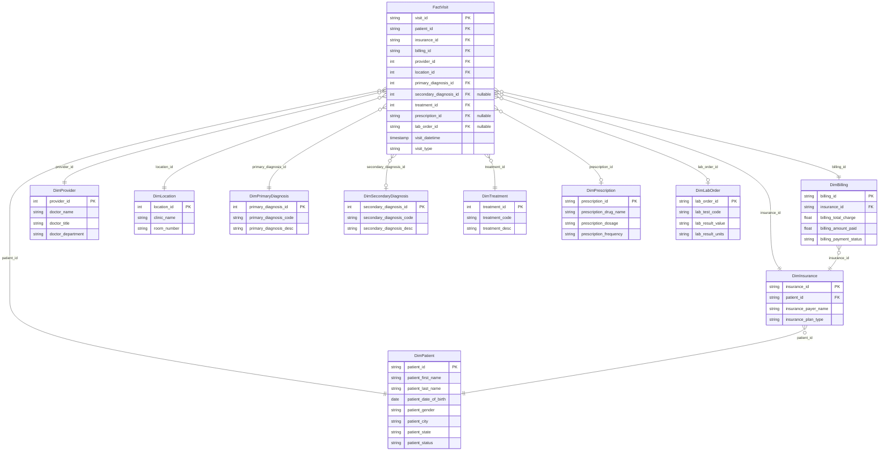

[](https://github.com/soorajmanoj/pyspark-etl-healthcare-normalization-pipeline/actions/workflows/ci.yml)

# Healthcare Data Normalization with PySpark

## Overview

This personal project showcases how legacy healthcare appointment data can be normalized into a structured snowflake schema using PySpark. The aim is to create an efficient and scalable ETL pipeline that prepares data for downstream analysis and visualization.

**Note:** The dataset used in this project is entirely synthetic and was generated for educational and demonstration purposes. It does not contain any real patient information.

---

## Objective

Transform flat healthcare records (CSV format) into well-defined dimension and fact tables. Key goals include:

- Building an end-to-end ETL pipeline in PySpark.
- Creating a normalized snowflake schema with proper foreign key relationships.
- Ensuring data integrity and analytical readiness.
- Using Tableau for dashboarding and insight generation.

---

## Features

- Fully automated ETL pipeline using PySpark
  - Normalization into 10 dimension tables and 1 fact table
- Referential integrity validation across all 10 foreign key relationships
- Support for optional healthcare data (e.g., prescriptions, lab orders)
- Tableau dashboards for analytical insights

---

## Schema (ERD)

This is a genuine **snowflake** schema, not a star schema wearing the name: two dimensions are normalized a level further rather than flattened directly onto the fact table. `DimInsurance` carries a `patient_id` back to `DimPatient`, and `DimBilling` carries an `insurance_id` back to `DimInsurance` — so `FactVisit → DimBilling → DimInsurance → DimPatient` is a real two-hop chain, not a flat star.



---

## Scale

From the included synthetic dataset (`data/legacy_healthcare_data.csv`):

| Table | Rows | Notes |
|---|---|---|
| Input (legacy flat file) | 530 visits | Single flat CSV, 45 columns |
| `FactVisit` | 530 | One row per visit |
| `DimPatient` | 530 | One row per unique patient |
| `DimInsurance` | 530 | |
| `DimBilling` | 530 | |
| `DimProvider` | 181 | Deduplicated across 530 visits |
| `DimLocation` | 496 | Deduplicated clinic/room combinations |
| `DimPrescription` | 375 | Nullable — not every visit prescribes |
| `DimLabOrder` | 313 | Nullable — not every visit orders labs |
| `DimPrimaryDiagnosis` | 10 | Deduplicated diagnosis codes |
| `DimSecondaryDiagnosis` | 10 | Nullable — not every visit has one |
| `DimTreatment` | 5 | Deduplicated treatment codes |

A single flat 45-column file normalizes down to 10 focused dimension tables (as few as 3 columns each) plus a fact table — the kind of column-count reduction that's the whole point of normalization.

---

## Before / After: One Row, Traced End to End

One real row from the legacy CSV (`visit_id = Vb89557`), traced through to every table it lands in:

**Legacy input row (abridged):**
```
visit_id: Vb89557
visit_datetime: 2024-05-13 13:33:25.824916
visit_type: Follow-up
patient_id: 2ad61d54, patient_first_name: Vanessa, patient_last_name: Wilson
insurance_id: ae80b07a, insurance_payer_name: Martin Inc, insurance_plan_type: PPO
billing_id: ffada062, billing_total_charge: 1745.17, billing_payment_status: Pending
doctor_name: Adrienne Miller DVM, doctor_title: NP, doctor_department: Set designer
clinic_name: Tucker-Chang, room_number: 220
primary_diagnosis_code: Dd29351
treatment_code: T6c9074
prescription_id: 488b09ac, prescription_drug_name: manage tonight
lab_order_id: 0341123c, lab_result_value: 20.78
```

**Splits into:**

| Table | Row |
|---|---|
| `DimPatient` | `2ad61d54, Vanessa, Wilson, 1995-07-13, F, ..., Active` |
| `DimInsurance` | `ae80b07a, 2ad61d54, Martin Inc, ..., PPO` |
| `DimBilling` | `ffada062, ae80b07a, 1745.17, 1544.38, ..., Pending` |
| `DimProvider` | `139, Adrienne Miller DVM, NP, Set designer` |
| `DimLocation` | `0, Tucker-Chang, 220` |
| `DimPrimaryDiagnosis` | `3, Dd29351, That win carry believe base nation piece.` |
| `DimTreatment` | `1, T6c9074, Begin up international despite.` |
| `DimPrescription` | `488b09ac, manage tonight, 983mg, Twice daily, 16.0` |
| `DimLabOrder` | `0341123c, Lfdb996, ..., 20.78, U/L, ...` |
| `FactVisit` | `Vb89557, 2ad61d54, ae80b07a, ffada062, 139, 0, 3, , 1, 488b09ac, 0341123c, ..., Follow-up` |

Notice `FactVisit` stores `139` and `0` for provider and location, not the doctor's name or clinic name — those got assigned a surrogate integer key the first time PySpark's `monotonically_increasing_id()` encountered that unique doctor/clinic combination, and every other visit with that same doctor or clinic reuses the same ID. That's deduplication happening structurally, not just in theory.

---

## Project Structure

```
pyspark-etl-healthcare-normalization-pipeline/
├── .github/
│   └── workflows/
│       └── ci.yml                         # Runs pytest on every push/PR
├── data/
│   ├── legacy_healthcare_data.csv         # Input dataset
│   ├── output/                            # CSV output for dimension and fact tables
│   └── output_parquet/                    # Parquet output (with --output-format parquet/both)
├── src/
│   ├── main.py                            # Driver script (supports --output-format csv|parquet|both)
│   └── data_processor.py                  # Data normalization, FK check, and save logic
├── tests/
│   ├── conftest.py                        # Shared local SparkSession fixture
│   └── test_data_processor.py             # Tests for dedup, status logic, and FK checks
├── tableau/
│   ├── Legacy Healthcare.twb              # Tableau workbook
│   └── tableau_screenshots/
│           └── Dashboard.png              # Tableau dashboard image
├── requirements.txt
├── requirements-dev.txt                   # pytest (not needed to just run the pipeline)
└── README.md
```

---

## Packages Required

```
pyspark
os
shutil
glob
```

---

## How to Run

### 1. Set up the Virtual Environment

```bash
python3 -m venv venv
source venv/bin/activate
pip install -r requirements.txt
```

### 2. Execute the ETL Pipeline

```bash
python src/main.py
```

This defaults to CSV output (matching the original behavior). To also or instead write Parquet — the columnar format real data warehouses actually use, unlike CSV:

```bash
python src/main.py --output-format parquet   # Parquet only, written to data/output_parquet/
python src/main.py --output-format both      # both CSV and Parquet
```

This script will:

- Read the legacy CSV file.
- Normalize and output the following tables:
  - `DimPatient`
  - `DimInsurance`
  - `DimBilling`
  - `DimProvider`
  - `DimLocation`
  - `DimPrimaryDiagnosis`
  - `DimSecondaryDiagnosis`
  - `DimTreatment`
  - `DimPrescription`
  - `DimLabOrder`
  - `FactVisit`
- Save them as individual CSVs in the `data/output/` directory.
- Run foreign key integrity checks to validate joins.

---

## Foreign Key Integrity Checks

After generating all tables, the script automatically checks whether foreign key values in `FactVisit` exist in the relevant dimension tables — all 10 relationships, including the `DimInsurance → DimPatient` and `DimBilling → DimInsurance` links.

- Null values are permitted in:
  - `secondary_diagnosis_id`
  - `prescription_id`
  - `lab_order_id`

These represent real-world scenarios where not all visits require secondary diagnoses, prescriptions, or lab orders.

---

## Dashboard Highlights (Tableau)

Tableau was used to create the following visualizations based on the normalized dataset:

- Annual Patient Visit Distribution by Clinic (2022–2025)
- Distribution of Visit Types Across All Patients
- Clinic Visit Volume by Day and Hour
- Billing Payment Status Distribution Among Visits
- Patient Count by Gender


---

## Testing

```bash
pip install -r requirements.txt -r requirements-dev.txt
pytest -v
```

Tests exercise the real transformation logic against small in-memory sample data — patient dedup and Active/Inactive status derivation, the `DimInsurance → DimPatient` foreign key surviving the join, provider surrogate key assignment, and the foreign-key-check function itself (pass case, mismatch detection, and expected-null handling). Every push and pull request to `main` runs this suite automatically via GitHub Actions.

**Honesty note:** these tests were originally written against the real PySpark and pytest APIs without being executed locally (no Spark/Java available in that environment) — they've since been confirmed passing in GitHub Actions (CI badge above), which is the real verification.

## License

MIT — see [LICENSE](LICENSE).